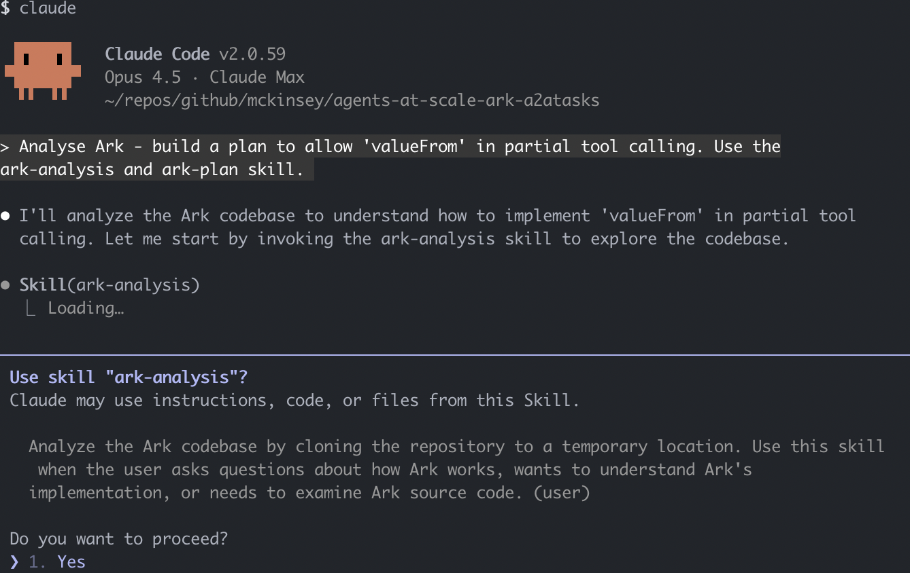

# Ark Claude Code Marketplace

Claude Code plugin for working with [Ark](https://github.com/mckinsey/agents-at-scale-ark).



Note: these skills are largely designed for agents running in sandboxes, with access to `kind` to run clusters.

## Quickstart

Open Claude, choose `/Plugin` to interactively add the marketplace `dwmkerr/ark-claude-code-marketplace`, or:

```bash
claude /plugin marketplace add dwmkerr/ark-claude-code-marketplace
claude /plugin install ark@ark-claude-code-marketplace
```

## Plugin: ark

Skills for Ark development and testing:

| Skill | Description |
|-------|-------------|
| **chainsaw** | Run and write Chainsaw e2e tests with mock-llm |
| **dashboard** | Test Ark Dashboard UI with Playwright |
| **setup** | Set up and install Ark from source |
| **analysis** | Analyze the Ark codebase |
